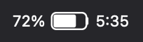
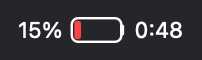
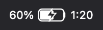
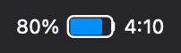
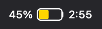

# battery-time-menubar

<p align="center"></p>

A tiny standalone macOS menu-bar app ("Battery Time.app", built on
[StatusItemKit](https://github.com/nicholaspsmith/StatusItemKit)) that restores
the estimated battery **time remaining** to the menu bar — Apple removed the
always-visible estimate in Sierra (2016) — with instant plug/unplug updates and
a details dropdown. Part of the [Menubarn](https://widgets.nicksmith.software)
widget library.

The app is the primary deliverable (see "Standalone Swift app" below). The
original [SwiftBar](https://github.com/swiftbar/SwiftBar) plugin remains in the
repo as a fallback; the "SwiftBar plugin" sections at the end cover it.

## What it shows

**Menu bar** — a native-style **battery glyph** (fill proportional to charge) with
the **percentage to its left** and the **time remaining to its right**, drawn as
one tight image by the compiled `render-title` helper (auto-adapts to light/dark),
so it spaces like the native icons. State is shown by the fill colour and a bolt:

| State | Menu bar |
|-------|----------|
| On battery |  |
| Low (≤20%) |  |
| Charging |  |
| High Power mode |  |
| Low Power mode |  |

(Examples rendered by the same `render-title` helper the menu bar uses.)

- **Charging** — the glyph is bisected by a **bolt** cutout (and shows time-to-full).
- **High Power mode** — the glyph fill turns **blue** (including while charging).
- **Low Power mode** — the glyph fill turns **yellow** (like the native icon).
- On battery the fill turns **red** at ≤20%; time is to-empty.
- Independent **icon / percentage / time** toggles ("Menu bar shows…" in the dropdown).
- Right after unplug macOS takes ~30–60s to compute its estimate; until then the
  plugin shows its own (measured discharge, or a nominal ~12 W when idle) so a
  time appears immediately instead of `--:--`. **Our stop-gap** is capped at the
  nominal (so a near-zero idle draw can't project an unrealistic 20h+); once
  macOS has its own estimate it's shown as-is. Whole hours render compactly as `8h`.
- Falls back to "`pct% [bolt] time`" text if `render-title` isn't compiled. Always
  renders something, so it keeps its position under menu-bar managers like
  [Curtain](https://github.com/nicholaspsmith/menubar-curtain).

**Dropdown** (click the item):

- A native-style **Energy Mode** section at the top — Automatic / Low Power /
  High Power, the active one checkmarked; selecting one sets `pmset powermode`
- Battery percentage
- A detailed status line — `3 hr 14 min until empty`, `Charging - 1 hr 20 min until full`, `Fully charged`, …
- Extra stats (one `ioreg` call): health + cycle count, live power draw (V×A),
  adapter wattage, and temperature (with a °C/°F toggle) / voltage / raw charge (mAh)
- 24-hour usage — time on battery vs plugged in, parsed from `pmset -g log`
  (which is slow, so it's recomputed in the background and cached ~10 min — the
  scrape never blocks a refresh)
- Battery-longevity **tips** — a "Battery Life Tips" item (shown only when a
  trigger fires: deep discharges, prolonged high charge, running warm, or cycle
  count near rated life) that opens a dialog with the advice (keeps the dropdown narrow)
- **Menu bar shows…** — toggle the battery icon / percentage / time independently
- **Open Battery Settings...** — opens the Battery pane in System Settings

## Updates

- Refreshes in place every 5s (estimate drift).
- **Instant on plug/unplug** via in-process IOKit power-source notifications
  (the same signal the native battery icon uses), so the title updates the
  moment AC changes and the status item is never re-created — which is what
  keeps its position under a menu-bar manager. (The SwiftBar fallback gets the
  same effect from `power-watch.sh`, a launchd agent listening to
  `pmset -g pslog`.)

## Standalone Swift app

The standalone Swift menu-bar app (`BatteryTime`, "Battery Time.app") is built
on [StatusItemKit](https://github.com/nicholaspsmith/StatusItemKit) — no SwiftBar
host required. All the `pmset` / `ioreg` / log parsing lives in a pure,
unit-tested `BatteryTimeCore` library; the battery glyph is folded in from
`render-title.swift`.

```sh
./scripts/build-app.sh          # produces build/Battery Time.app
open "build/Battery Time.app"
```

It replaces the `power-watch` launchd agent with **in-process IOKit power-source
notifications** (instant plug/unplug updates) and reuses the existing
passwordless-sudo rule for the energy-mode toggle (see "Energy mode selector"
below). The SwiftBar plugin remains in the repo as a fallback.

### Start at Login

Two ways to launch it automatically (use **one**, not both, or it may start twice):

- **In-app toggle** — the menu's **Start at Login** item registers the app via
  `SMAppService` (bundle-ID based, not a LaunchAgent). macOS requires the app to
  live in `/Applications` or `~/Applications`, so point a symlink there first
  (e.g. `~/Applications/Battery Time.app` → `build/Battery Time.app`), then toggle it.
- **macOS Login Items** — add the app under System Settings → General → Login Items
  ("Open at Login"). Same effect, and it doesn't require the in-app toggle.

## SwiftBar plugin (fallback)

The original plugin still works if you would rather run it under SwiftBar
instead of the standalone app. Requirements:

- macOS laptop
- [SwiftBar](https://github.com/swiftbar/SwiftBar) (`brew install swiftbar`)
- Xcode Command Line Tools (`swiftc`) for the tight image rendering — optional;
  without it the menu-bar title falls back to (slightly wider) text

### Install (plugin)

```sh
./install.sh
```

This:
1. Symlinks `battery-time.5s.sh` into `~/.config/SwiftBar/` (override with `SWIFTBAR_PLUGIN_DIR`).
2. Installs and loads the `com.nicholassmith.battery-time-power-watch` launchd
   agent (logs to `~/Library/Logs/battery-time-power-watch.log`).

Then ⌘-drag the item next to the battery icon.

### Energy mode selector (one-time setup)

Changing the energy mode runs `pmset powermode`, which requires root. To make the
selector one-click with no password prompt, install a tightly-scoped sudoers rule
(permits only `pmset -b/-c powermode 0|1|2` — nothing else):

```sh
sudo ./install-powermode-sudoers.sh
```

On Apple Silicon the energy mode is `powermode` (0 = Automatic, 1 = Low Power,
2 = High Power). The selector sets the mode for the **current** power source, so
changing it on battery won't disturb a High Power-on-AC setting. (High Power only
takes effect where the hardware supports it — generally on AC.)

## Test

```sh
./test/test_battery_time.sh
```

Fixture-driven (via `PMSET_FIXTURE`): checks the menu-bar title and dropdown
content for each power state, with no real battery required.

### Uninstall (plugin)

```sh
launchctl bootout "gui/$(id -u)/com.nicholassmith.battery-time-power-watch"
rm ~/Library/LaunchAgents/com.nicholassmith.battery-time-power-watch.plist
rm ~/.config/SwiftBar/battery-time.5s.sh
sudo rm -f /etc/sudoers.d/battery-time-powermode
```

## Files

- `battery-time.5s.sh` — the SwiftBar plugin (menu-bar title + dropdown)
- `power-watch.sh` — `pmset -g pslog` watcher for instant plug/unplug refresh
- `com.nicholassmith.battery-time-power-watch.plist` — launchd agent template
- `install.sh` — installer (plugin symlink + launchd agent)
- `install-powermode-sudoers.sh` — one-time passwordless-sudo rule for the toggle
- `render-title.swift` — compiles to `bin/render-title`; draws the battery glyph (+ % / time, charging bolt, coloured fill)
- `set-tempunit.sh` — persists the dropdown °C/°F temperature unit
- `set-display.sh` — toggles the menu-bar icon / percentage / time prefs
- `show-tips.sh` — opens the current battery-longevity tips in a dialog
- `test/test_battery_time.sh` — fixture tests
- `docs/` — design notes and plan

## Why not a SwiftBar plugin?

This is a standalone `.app` built on [StatusItemKit](https://github.com/nicholaspsmith/StatusItemKit), not a script under a plugin host: no SwiftBar to install, a real AppKit menu instead of rendered stdout, event-driven updates instead of a re-run timer, and an icon that keeps its place in the bar. Plug/unplug updates come from in-process IOKit power-source notifications; the plugin version needed a separate launchd agent just to poke SwiftBar into refreshing. The full comparison is in [StatusItemKit's README](https://github.com/nicholaspsmith/StatusItemKit#why-not-swiftbar).

## The menu-bar suite

Part of a suite of macOS menu-bar apps that share one framework, one
build-and-sign script, and one installer. They are designed to sit in the
same bar together: consistent menus, a common **Icon** picker for shape and
colour, and cooperative hiding so no icon strands another.

| App | What it does |
|---|---|
| [Claude Usage](https://github.com/nicholaspsmith/claude-usage-menubar) | Claude Code plan limits, resets, and live agent sessions |
| [Apollo Monitor](https://github.com/nicholaspsmith/apollo-monitor-menubar) | Universal Audio Apollo monitor level, plus a UA process watchdog |
| **Battery Time** | Time remaining, power mode, and 24h usage |
| [VPN & DNS](https://github.com/nicholaspsmith/vpn-dns-menubar) | One dot for Mullvad + Tailscale state, with a DNS watcher |
| [Process Monitor](https://github.com/nicholaspsmith/MacOS_Process_Monitor) | Process-count sparkline against the per-UID limit |
| [KeyLight](https://github.com/nicholaspsmith/keylight-menubar) | Ctrl+brightness keys remapped to keyboard backlight |
| [MacRecorder](https://github.com/nicholaspsmith/MacRecorder) | Screen recording with system audio |
| [Media Tracking Killer](https://github.com/nicholaspsmith/media-tracking-killer-menubar) | Kills Apple's media tracking daemons |
| [Download Recycler](https://github.com/nicholaspsmith/download-recycler-menubar) | Sweeps stale files out of ~/Downloads |
| [Curtain](https://github.com/nicholaspsmith/menubar-curtain) | Hides a block of status icons by width, so it cannot strand one |

| Framework | |
|---|---|
| [StatusItemKit](https://github.com/nicholaspsmith/StatusItemKit) | Status-item lifecycle, polling, menus, meter icons, the shared Icon picker |
| [HotkeyKit](https://github.com/nicholaspsmith/HotkeyKit) | CGEventTap engine for intercepting and remapping global keys |

Install the whole suite on a fresh Mac with
[macOS Dev Environment Setup](https://github.com/nicholaspsmith/MacOS-Dev-Environment-Setup):

```bash
git clone https://github.com/nicholaspsmith/MacOS-Dev-Environment-Setup.git
cd MacOS-Dev-Environment-Setup && ./bootstrap.sh --all
```
