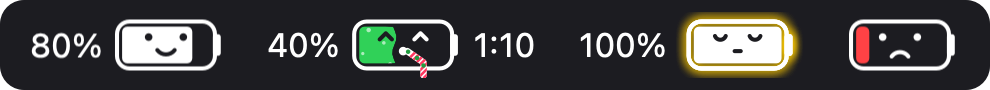
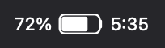
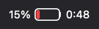
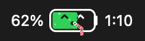
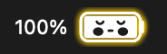
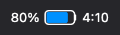
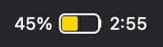

# battery-time-menubar

<p align="center"></p>

<p align="center"></p>

**Version 1.2.1** · [Changelog](https://github.com/nicholaspsmith/battery-time-menubar/releases)

A standalone macOS menu-bar app ("Battery Time.app", built on
[StatusItemKit](https://github.com/nicholaspsmith/StatusItemKit)) that puts the
estimated battery **time remaining** back in the menu bar, updates the instant
you plug in or unplug, and shows battery details in its dropdown. Part of
[Menumon](https://menumon.nicksmith.software).

## Requirements

- macOS 13 or later, on a Mac with a battery
- Swift toolchain (Xcode or the Command Line Tools)
- [StatusItemKit](https://github.com/nicholaspsmith/StatusItemKit) cloned beside this repo (`../StatusItemKit`)

## Install

```sh
./install.sh                    # build, link into ~/Applications, ask about Start at Login, launch
./scripts/build-app.sh          # build only: produces build/Battery Time.app
```

## What it shows

### Menu bar

A battery glyph (fill proportional to charge) with the **percentage** to its
left and the **time remaining** to its right, drawn as one image that follows
the menu bar's light/dark appearance.



By default the battery has a face — Volta (**Battery face** in the dropdown
turns it off). On battery his mood follows the charge: a smile when full, a
flat line around half, a slight frown below a third, a frown when low. Where
the face crosses the empty part of the battery it is drawn in the menu-bar ink
so it stays visible.

| State | Menu bar |
|-------|----------|
| On battery |  |
| Low (≤20%) |  |
| Charging |  |
| Plugged in, not charging |  |
| High Power mode |  |
| Low Power mode |  |

- **On battery** — time to empty; the fill turns **red** at ≤20%.
- **Charging** — time to full. With the face on, the fill turns green and Volta
  drinks through a straw that comes up from below, a bead of charge running up
  it every couple of seconds; with the face off, a **bolt** cuts through the glyph.
- **Plugged in, not charging** (full, or macOS holding the charge at a limit) —
  with the face on, Volta is full: eyes contentedly closed, glowing yellow.
- **High Power mode** — **blue** fill, including while charging.
- **Low Power mode** — **yellow** fill.

Once a minute Volta blinks while his charge sloshes from side to side, or,
when stuffed, burps. When several Menumon mascots are running they take turns,
a second apart: Archimedes (Claude Usage), Menu Pimp (Mac Daddy), Carol
(SoundChain), Iguanamous (VPN & DNS), Armonitor (Monitor Lizard), then Volta,
counting only the ones that are running. The minute animation and the sip are
skipped when Reduce Motion is on.

Time details:

- The on-battery time is 95% of macOS's estimate, which runs a little optimistic.
- For the 30–60 s after unplugging, before macOS has an estimate, the app
  projects its own from the measured draw, capped at a nominal ~12 W so a
  near-idle draw cannot show 20h+. Without either, it shows `--:--`.
- Whole hours render compactly as `8h`.
- The icon, percentage and time toggle independently ("Menu bar shows…"). With
  the icon off it shows plain text (`pct% time`). It always shows something, so
  it keeps its position under menu-bar managers.

### Dropdown

- **Energy Mode** — Automatic / Low Power / High Power, the active one
  checkmarked; selecting one runs `pmset powermode` (see
  [Energy mode selector](#energy-mode-selector-one-time-setup))
- Battery percentage and a status line (`3 hr 14 min until empty`,
  `Charging - 1 hr 20 min until full`, `Fully charged`, …)
- From one `ioreg` call: health and cycle count, live power draw (V×A), adapter
  wattage, temperature (with a °C/°F toggle), voltage and raw charge (mAh)
- 24-hour usage — time on battery vs plugged in, parsed from `pmset -g log`.
  That is slow, so it is recomputed in the background at most every 10 minutes
  and never blocks a refresh
- **Battery Life Tips** — shown only when a trigger fires (deep discharges,
  prolonged high charge, running warm, or cycle count near rated life); opens a
  dialog with the advice
- **Menu bar shows…** — Battery icon, Battery face, Percentage, Time remaining
- **Start at Login**, **Open Battery Settings…**, version, **Quit**

## How it works

- `BatteryTimeCore` is a pure, unit-tested library holding all the `pmset`,
  `ioreg` and `pmset -g log` parsing and the time math.
- The `BatteryTime` app polls every 5 s (the estimate drifts) and runs the
  blocking `pmset`/`ioreg` calls off the main thread; overlapping refreshes are
  coalesced.
- Plug/unplug refreshes instantly via in-process IOKit power-source
  notifications (`PowerSourceWatcher`). The status item is updated in place,
  never re-created, which keeps its position under a menu-bar manager.
- `BatteryGlyph` draws the menu-bar image.

## Start at Login (optional)

Use **one** of these, not several, or it may start twice:

- **Command line** — scriptable; what a fresh setup should use. It must be the
  *installed* binary, because `SMAppService` registers the calling bundle:

  ```sh
  "$HOME/Applications/Battery Time.app/Contents/MacOS/BatteryTime" --login on   # or: off, status
  ```

  A bare `--login` or `--login status` only reports the state. `./install.sh`
  asks whether to do this when run in a terminal.
- **In-app toggle** — the menu's **Start at Login** item (`SMAppService`, not a
  LaunchAgent). macOS requires the app to live in `/Applications` or
  `~/Applications`, which `install.sh`'s symlink satisfies.
- **macOS Login Items** — System Settings → General → Login Items.

## Energy mode selector (one-time setup)

`pmset powermode` needs root. For a one-click selector with no password
prompt, install a sudoers rule that permits only `pmset -b/-c powermode 0|1|2`:

```sh
sudo ./install-powermode-sudoers.sh
```

On Apple Silicon `powermode` is 0 = Automatic, 1 = Low Power, 2 = High Power.
The selector sets the mode for the **current** power source only, so changing
it on battery leaves a High Power-on-AC setting alone. High Power only takes
effect where the hardware supports it, generally on AC.

## Test

```sh
swift test                      # BatteryTimeCore unit tests
```

## Files

- `Sources/BatteryTimeCore/` — parsing and time math (unit-tested)
- `Sources/BatteryTime/` — the app: status item, menu, glyph, power-source watcher
- `scripts/build-app.sh` — builds `build/Battery Time.app` via StatusItemKit's `make-app.sh`
- `install.sh` — installs the app
- `install-powermode-sudoers.sh` — one-time passwordless-sudo rule for the energy-mode selector
- `docs/` — design notes and plans

## The menu-bar suite

A suite of macOS menu-bar apps that share one framework, one build-and-sign
script and one installer, built to sit in the same bar: consistent menus, a
common **Icon** picker, and cooperative hiding so no icon strands another.

| App | What it does |
|---|---|
| [Claude Usage](https://github.com/nicholaspsmith/claude-usage-menubar) | Claude Code plan limits, resets, and live agent sessions |
| [Apollo Monitor](https://github.com/nicholaspsmith/apollo-monitor-menubar) | Apollo audio-interface monitor level |
| **Battery Time** | Time remaining, power mode, and 24h usage |
| [VPN & DNS](https://github.com/nicholaspsmith/vpn-dns-menubar) | An iguana for Mullvad + Tailscale state, with a DNS watcher |
| [Mac Daddy](https://github.com/nicholaspsmith/mac-daddy-menubar) | Kills media trackers, trashes stale downloads, reaps hung processes, watches the UA mixer engine, and sweats as your process count climbs |
| [KeyLight](https://github.com/nicholaspsmith/keylight-menubar) | Ctrl+brightness keys remapped to keyboard backlight |
| [Monitor Lizard](https://github.com/nicholaspsmith/monitor-lizard-menubar) | External-monitor brightness, contrast and resolution, Night Shift, and the built-in screen from dimmer than macOS allows to XDR |
| [Homestead](https://github.com/nicholaspsmith/home-assistant-menubar) | Home Assistant dashboards and device controls in the menu |
| [SoundChain](https://github.com/nicholaspsmith/soundchain-menubar) | One chain of Audio Unit effects over all system audio |
| [Menu Crane](https://github.com/nicholaspsmith/menu-crane) | A ⌘Space launcher for apps, arithmetic, unit conversions and emoji |
| [MacRecorder](https://github.com/nicholaspsmith/MacRecorder) | Screen recording with system audio |
| [Barn](https://github.com/nicholaspsmith/menubar-barn) | macOS 26 and earlier only: hides a block of status icons by width (on macOS 27, use System Settings ▸ Menu Bar) |

| Framework | |
|---|---|
| [StatusItemKit](https://github.com/nicholaspsmith/StatusItemKit) | Status-item lifecycle, polling, menus, meter and mascot icons, the shared Icon picker |
| [HotkeyKit](https://github.com/nicholaspsmith/HotkeyKit) | CGEventTap engine for intercepting and remapping global keys |

Install the whole suite on a fresh Mac with
[macOS Dev Environment Setup](https://github.com/nicholaspsmith/MacOS-Dev-Environment-Setup):

```bash
git clone https://github.com/nicholaspsmith/MacOS-Dev-Environment-Setup.git
cd MacOS-Dev-Environment-Setup && ./bootstrap.sh --all
```

## Releasing

Every push to `main` is a release. Before pushing, add a dated
`## [X.Y.Z] - YYYY-MM-DD` section to the top of [`CHANGELOG.md`](CHANGELOG.md)
(minor for features, patch for fixes; turn a waiting `## [Unreleased]` into
it). When it reaches `main`, GitHub tags `vX.Y.Z` and publishes the section as
a release titled `vX.Y.Z`. Without a new version:

- a push is refused locally by the `pre-push` hook;
- a pull request **cannot merge** — `release / check` is required on `main`;
- a push that reaches `main` anyway fails the release workflow.

The one exception is `[no release]` in the tip commit's message, for changes
nothing a user runs (setup, CI, developer docs): it passes every check with no
version bump and no tag. Never tag or create a release by hand, and never
`gh pr merge --admin` past a failing check — fix the PR. After merging,
`git pull` for the tag and rebuild. `install.sh` re-arms the hook on a fresh
clone.
See [StatusItemKit — Releases](https://github.com/nicholaspsmith/StatusItemKit#releases-every-push-is-one) for the whole rule.

## License

Copyright (c) 2026 Nicholas Smith. Licensed under the
[Mozilla Public License 2.0](LICENSE). You may use, modify, sell and
redistribute this software, including inside proprietary products, provided
the copyright notice and license stay on these files and any modified
versions of them are made available under the same license.
